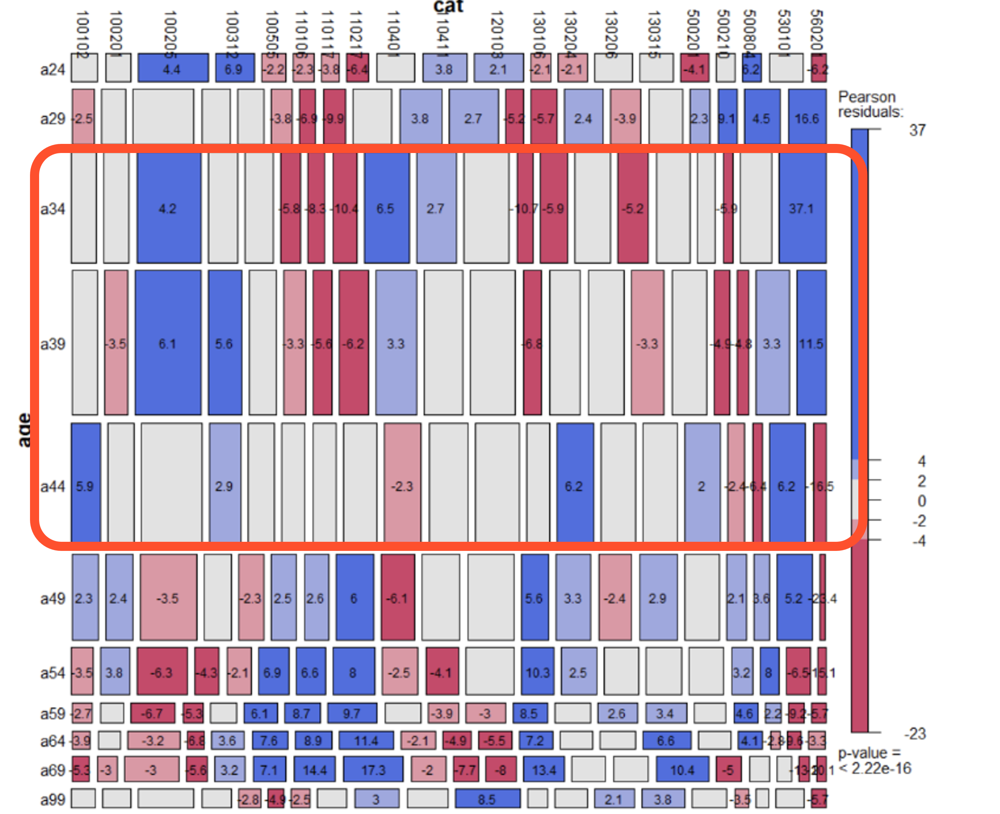

# Tafeng資料集商業分析

### 資料來源
- https://www.kaggle.com/datasets/chiranjivdas09/ta-feng-grocery-dataset/data

### 地區分析

- Z115、Z221地區的顧客最多
- 同時其貢獻的毛利最多，購買毛利貢獻前20大品項的數量最多

### 年齡分析

- 年齡34~44歲族群貢獻的毛利最多，購買毛利貢獻前20大品項的數量最多

- 34~44歲族群，購買頻率較少、平均客單價較高
- 65~69歲族群，購買頻率較高、平均客單價較低

### 目標客群分析

- 34~44歲族群主要居住在 Z221、z114
- 69歲族群主要居住在Z115

- 34~44歲族群購買行為多集中假日
- 65~69歲購買行為偏好平日，避開假日人潮

- 560201,100205,110401,530101 同時是前十大毛利品類,也是34~44主要購買的品類

### RFM分群

- RFM分群泡泡圖中，依據來店時間、購買頻率、平均客單價劃分出四大客群，主要針對平均客單價高的維度，去選擇兩大重要客戶，分別為「重要挽留客戶」及「重要保持客戶」

- 重要保持客戶：預期購買金額與機率較高；重要挽留客戶：預期購買機率較低，前者可提出相應策略提高黏著度，後者則是激發更多消費需求
